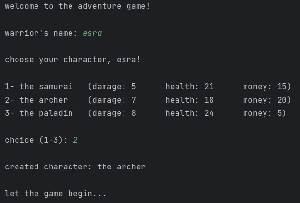
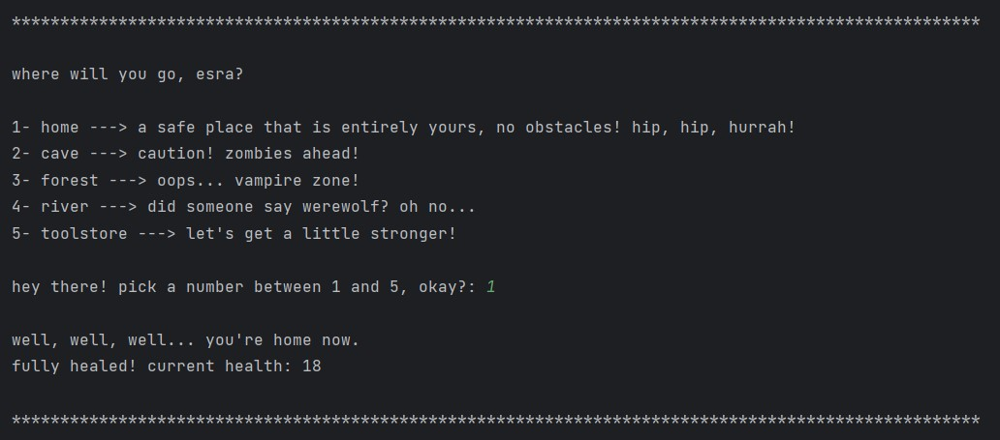
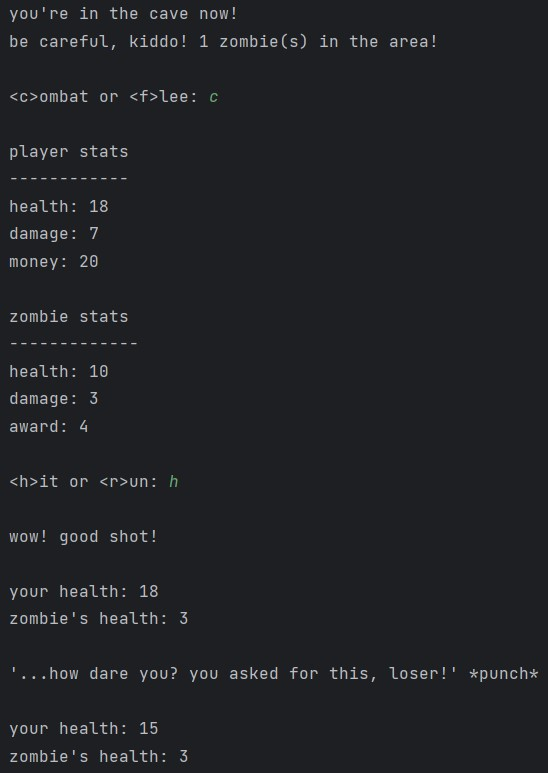

# Realm of Shadows

## Overview

This project is a simple console-based RPG (Role-Playing Game) where
players engage in battles with monsters by choosing different characters.

## Installation

1. Clone the repository to your local machine.

   `git clone https://github.com/esraekmekci/realm-of-shadows-game.git`
2. Open the project in your IDE of choice.
3. Run the `Main` class.
4. Enjoy!

## Sample Images

#### 1. *Pick your hero and start the journey!*

#### 2. *Choose your next destination. Arm yourself, heal or dive into battle!*

#### 3. *Battle random numbers of creatures. Gather items or bid farewell to the game.*

